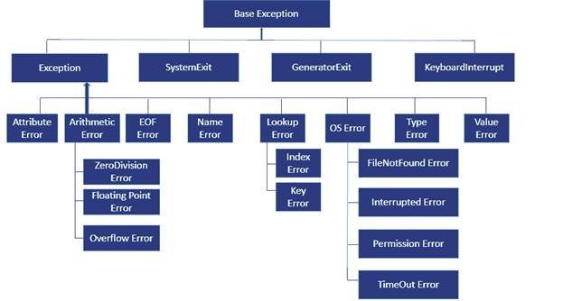

## Методы класса (classmethod) и статические методы (staticmethod)

В классах Python можно определить три типа методов: обычные методы, методы класса (**@classmethod**) и статические методы (**@staticmethod**).

* Обычные методы вызываются из экземпляров класса и работают с атрибутами этого экземпляра через параметр ``self``.
* Методы класса (@classmethod) работают только с атрибутами класса и имеют доступ к локальным свойствам экземпляра, из которого были вызваны.
* Статические методы (@staticmethod) работают независимо от экземпляров класса и не имеют доступа к локальным свойствам.


## Инкапсуляция.Режимы доступа *public*, *private*, *protected*. Геттеры и сеттеры.

### Ограничение доступа к атрибутам
* Если перед именем атрибута стоит одно подчеркивание (_), то он приобретает режим доступа *protected* (служит для обращения внутри класса и во всех его дочерних классах).
* Если два подчеркивания (__), то режим доступа - *private* (служит для обращения только внутри класса).
* Если без подчеркиваний - режим доступа *public*.

### Интерфейсные методы

В классах создаются приватные атрибуты и определяются дополнительные методы для работы с ними извне.

Эти методы называются **геттерами** и **сеттерами**. Они используются для того, чтобы получать доступ к защищенным атрибутам класса.

Простые геттеры и сеттеры выглядят следующим образом 

```python
class Person
    def __init__(self, name, old):
        self.__name = name
        self.__old = old

    def get_old(self):
        return self.__old

    def set_old(self, old):
        self.__old = old


Sergey = Person('Sergey', 20)
print(Sergey.get_old())
Sergey.set_old(35)
```

Но такую запись **не рекомендуется** использовать, т.к существует дублирование кода. Если свойств не много, то трудностей с работой такого класса не возникает. 

Но если свойств много и для каждого требуется геттер и сеттер, то дублирование кода значительно возрастает.

Поэтому для упрощения работы с защищенными свойствами используется декоратор ``@property``. Ниже привед код как его обычно используют

```python
class Person
    def __init__(self, name, old):
        self.__name = name
        self.__old = old

    @property
    def old(self):
        return self.__old

    @property.setter
    def old(self, old):
        self.__old = old

    @property.deleter
    def old(self):
        del self.__old


Sergey = Person('Sergey', 20)
print(Sergey.old)
Sergey.old = 35
```

Декоратор ``@deleter``, это часть декоратора ``@property`` и выполняет удаление свойства.

Использование декоратора ``@property`` это один способо урощенного создания геттеров и сетторов. Но и он не единственный. Для организации гетторов и сеттеров можно еще использовать **дескриптор**. Использование дескриптора еще больше улучшает написание и понимание кода если используются геттеры и сеттеры для 10 и более свойств.


Они используются для передачи значений между приватными атрибутами класса и проверки их корректности, при этом не нарушая логику работы класса.

В классах можно определять приватные и защищенные свойства и методы, но извне обратиться к ним нельзя.

Для доступа к приватным свойствам и методам можно использовать кодовые имена, но это **не рекомендуется**.

И чтобы вообще исключить возможность доступа к приватным атрибутам класса, можно использовать библиотеку *accessify*, в которой есть два декаратора: *private* и *protected*.


### Дескриптор

...


## Магические методы

### ``__call__``. Функторы


## ``__str__``, ``__repr__``

Метод ``__str__`` используется для вывода информации об объекте класса, а метод ``__repr__`` - для отладки. 


## Наследование

### Расширение и переопределение базового класса

Ресширением базового класса, называется если в дочерний класс добавлять методы, которые отсутствуют в базовом класса.

Переопределени базового класса, называется если в дочернием классе изменять поведение методов базового класса.

Делегирование - это вызов методов базового класса через функцию ``super``

```python
class Geom:
    def __init__(self, x, y):
        self.x = x
        self.y = y


class Rect(Geom):
    def __init__(self, x, y, z):
        super.__init__(x, y):
        self.z = z
```

### Приватные и защищенные атрибуты

В дочернем классе нельзя обратиться к приватным (``private``) атрибутам базового класса .

Для доступа к приватным атрибутам базового класса нужно использовать режим доступа ``protected``.


## Полиморфизм

### Абстрактные методы

_Полиморфизм_ - возможность работы с разными объектами единым образом, через единый интерфейс.

_Абстрактные методы_, это методы коготые не реализованы в базовом класса, но которые обязательно должны быть переопределены в дочерних классах.

### Множественное наследование. Примеси (Mixin)

```python
class Goods:
    def __init__(self, name, wieght, price):
        super().__init__()
        print('Init Goods')
        self.name = name
        self.weight = wieght
        self.price = price
        
    def print_info(self):
        print(f'{self.name}, {self.weight}, {self.price}')
        

class MixinLog:
    id = 0
    
    def __init__(self):
        print('init mixinlog')
        MixinLog.id += 1
        self.id = MixinLog.id
        
    def save_self_log():
        print(f'{self.id}: good is sales.')


class Laptop(Goods, MixinLog):
    pass


acer = Laptop('Acer', 1.5, 4000)
acer.print_info()
acer.save_self_log()
```

.png "Пример")

Нужно отметить, что в примеси **крайне не рекомендуется** передавать параметы, т.к. это в случае доработки классов, может служить источником ошибок.


## Исключения

**Иерархия исключений**. При написании исключений стоит помнить принцип от частного к общему.
Т.е при написании последовательности исключений, сначала прописывают более специальное исключение (3 слой) а потом более общие (1 слой)

